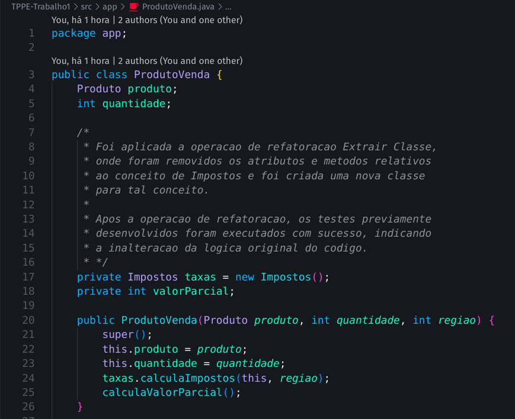

# Técnicas de Programação em Plataformas Emergentes

### Integrantes

| Matrícula | Nome |
| :--- | :--- |
| 20/0014447 | André Corrêa da Silva |
| 22/2015103 | Débora Caires de Souza Moreira |
| 20/0018167 | Gabriel Mariano da Silva |
| 19/0058455 | Mariana Oliveira Pires do Rio |

### Tecnologias Utilizadas

- **Java**: Utilizado como a linguagem principal de desenvolvimento do projeto.
- **JUnit 4**: Framework de testes usado para implementar o Desenvolvimento Orientado a Testes (TDD).
- **Git**: Sistema de controle de versão para rastreamento de mudanças no código.
- **IDE (Eclipse)**: Ambiente de desenvolvimento integrado para facilitar a codificação e testes.

## Trabalho 01

### Objetivos

    
CLIQUE PARA EXIBIR OS OBJETIVOS

    &nbsp;&nbsp;&nbsp;&nbsp;O objetivo deste trabalho é desenvolver um sistema de cadastro e gerenciamento de clientes e produtos utilizando técnicas de Desenvolvimento Orientado a Testes (TDD) com Java e JUnit 4. O sistema permitirá cadastrar clientes de diferentes categorias (padrão, especial e prime) com seus respectivos endereços, além de produtos com suas especificações detalhadas. Será possível realizar vendas, onde o sistema calculará automaticamente fretes, descontos, impostos e permitirá o uso de saldo de cashback para clientes prime. 
    &nbsp;&nbsp;&nbsp;&nbsp;Adicionalmente, o sistema avaliará o volume de vendas mensais de cada cliente para determinar elegibilidade para upgrades de categoria. A implementação será acompanhada de uma suíte de testes para garantir a qualidade e funcionalidade do software, assegurando que cada funcionalidade atenda aos requisitos definidos. 

### Requisitos

    
CLIQUE PARA EXIBIR OS REQUISITOS

    <h4>Funcionais</h4>
    <ul>
        <li>Cadastro de Clientes:</li>
            <li>- Implementar classes para os três tipos de clientes: padrão, especial e prime.</li>
            <li>- Cada cliente deve ter atributos como nome, tipo de cliente, e endereço (estado e se é capital ou interior).</li>
        <li>Cadastro de Produtos:</li>
            <li>- Implementar uma classe para representar diferentes tipos de produtos.</li>
            <li>- Cada produto deve ter atributos como código do item, descrição, valor de venda e unidade de medida (por exemplo, peça, unidade, metro, cm³).</li>
        <li>Realização de Vendas:</li>
            <li>- Implementar uma classe Venda que registre a data da venda, cliente, lista de itens vendidos e método de pagamento.</li>
            <li>- Calcular o valor do frete, descontos (se houver), impostos (ICMS e municipal).</li>
            <li>- Clientes prime podem usar saldo de cashback para abater na compra.</li>
            <li>Cálculo de Vendas do Último Mês:</li>
            <li>- Implementar métodos para calcular o valor das vendas realizadas no último mês para cada cliente.</li>
            <li>- Verificar se um cliente é elegível para se tornar cliente especial com base em critérios específicos (por exemplo, total de compras).</li>
        <li>Cálculo de Cashback para Clientes Prime:</li>
            <li>- Implementar o cálculo do saldo de cashback acumulado por clientes prime, baseado em percentuais das compras realizadas.</li>
    </ul>
    <h4>Não Funcionais</h4>
    <ul>
        <li>TDD (Test-Driven Development):</li>
            <li>- Desenvolver cada funcionalidade utilizando TDD, onde testes unitários são escritos antes da implementação do código.</li>
            <li>- Cada classe e método deve ter pelo menos um caso de teste.</li>
            <li>- Agrupar casos de testes relacionados em suites de testes quando apropriado.</li>
        <li>Java e JUnit 4:</li>
            <li>- O projeto deve ser desenvolvido em Java utilizando o JUnit 4 como framework de testes.</li>
            <li>- Outras linguagens e frameworks não são permitidos e resultarão em zero na avaliação.</li>
    </ul>

## Trabalho 02

Conforme apresentado na [Descrição do Trabalho 02](https://github.com/andrelanna/fga0242/tree/master/tps/tp1#trabalho-2-refatora%C3%A7%C3%A3o), foi exigida a aplicação de técnicas de refatoração sobre o *software* desenvolvido para o Trabalho 01. Abaixo, as orientações quanto à técnica a ser aplicada e o trecho de código (geralmente referente a uma classe ou método) sobre o qual deve ser aplicada.

A partir das orientações supracitadas, foram aplicadas as técnicas desejadas, tendo como resultado os trechos de código apresentados abaixo:

### Extrair Método

[**LINK PARA O COMMIT**](https://github.com/gabrielm2q/TPPE-TP1-TDD/commit/789dc928dbc0590d79f151deebefd458e045ac27)

### Extrair Classe

[**LINK PARA O COMMIT**](https://github.com/gabrielm2q/TPPE-TP1-TDD/commit/658e58d3cdd3229694cc907553f5ca3c18c0d178)

### Substituir Método por Objeto-Método

[**LINK PARA O COMMIT**](https://github.com/gabrielm2q/TPPE-TP1-TDD/commit/424be5ed9348e8b8049f06868f4f45ec2848c7b8)

